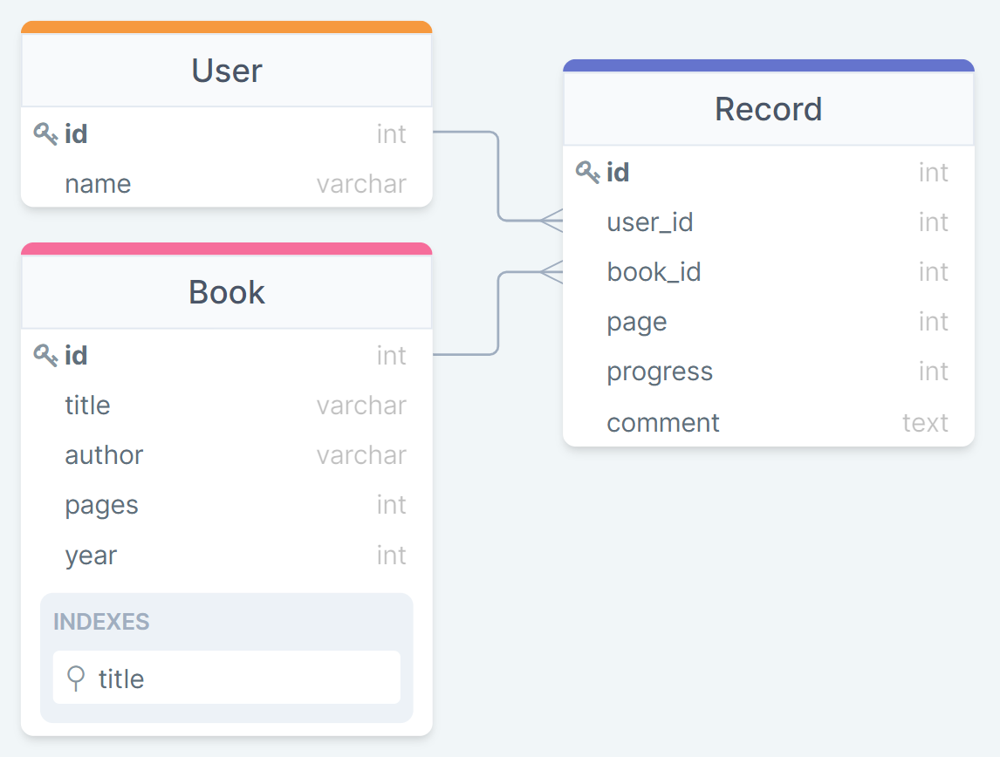

# BookMarker :closed_book: Telegram Bot 

    
    
    

## Описание

Целью работы является обсепечение конечного пользователя средством работы с менеджером  динимически добавляемых книг и их метаданных - пользовательские закладки и заметки. Графическим пользовательским интерфейсом для работы с приложением является Telegram и его стандартные средства для работы с ботами. Все пользовательские данные храняться в самостоятельной базе данных на удаленном сервере.

> Бот: [**@BookMarks_db_bot**](https://t.me/BookMarks_db_bot) 

## База данных

Описание таблиц и работа с БД реализованы в файлах `db/tables.py` и `db/api.py` соответственно.

    

- База данных реализована в третьей нормальной форме
- Количество таблиц - 3 (`User`, `Book`, `Record`)
- Индексированное текстовое поле - `title` в таблице `Book`
- Заполняемое триггером поле - `progress` в таблице `Record`

## Пользовательский интерфейс

Взаимодействие с интерфейсом БД описано в файлах `bot/server.py` и `bot/utils.py` и реализовано через текстовые сообщения в виде команд, отправляемых боту:

- `/help` - список доступных команд с описанием
- `/books` - список всех доступных книг
- `/search` - поиск книги (по названию и/или автору)
- `/add_book` - добавление книги в общую библотеку
- `/my_library` - список книг, добавленных в пользовательскую библиотеку

Демонстрационное видео с комментариями: ;(
